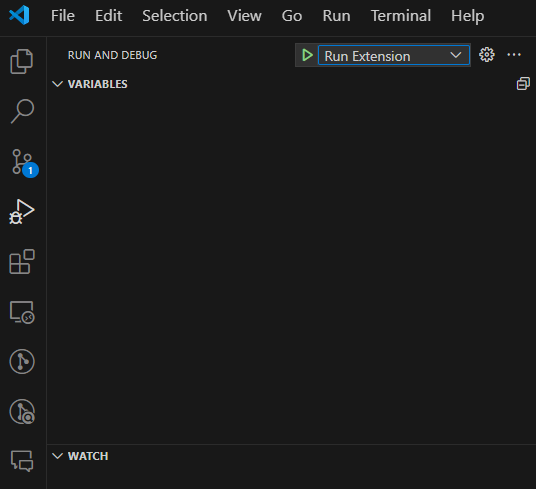
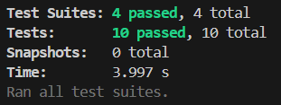
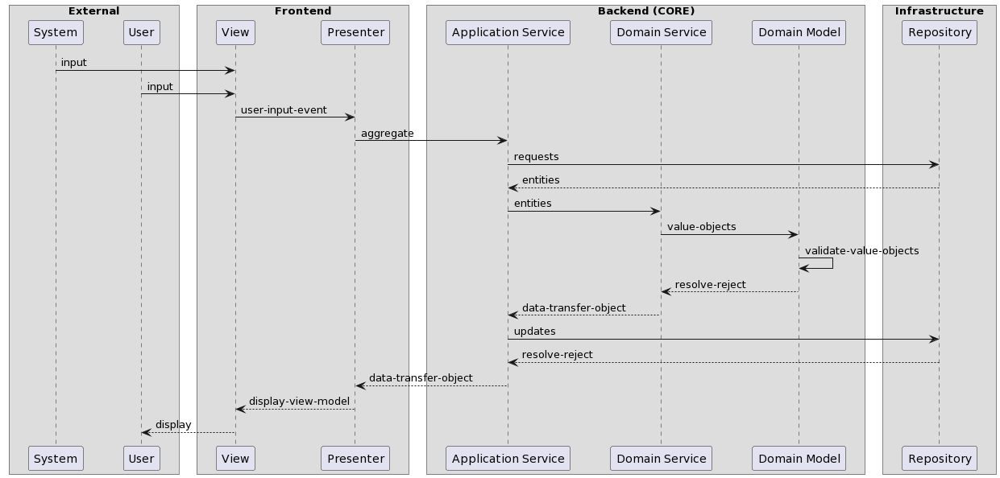

# What Is It?
This is a VS Code Marketplace Extension that allows us to connect Hardware Interface Devices (HIDs) to our computers and trigger VSCode commands. 😎

# How It Works


1. Make sure your HID hardware device is connected to your computer.
2. Open the command palette:
   
   a. **MAC**: (Command + Shift + P)
   
   b. **Windows**: (Control + Shift + P)
3. Type `vsconnect`.
   
   a. Select the `VSConnect` option.
4. Press the key on the HID device you want to use to trigger a VSCode command 10 times (explanation for selecting 10 times [here]()).
5. Filter for the command you want to trigger with your hardware device.
   
   a. In the GIF example above, we are triggering the VSCode `Create New File` command.
6. You should see a notification in the bottom right screen that reads  `[VSCode Command] is now connected!`.
7. Press the key HID trigger and watch the VSCode command work!

# Want to Contribute?
## Run the Extension Locally
This project has only been tested on the [Ubuntu (Linux) operating system](https://ubuntu.com/desktop). If you happen to make this function properly on other operating systems, it'd be great if you could let me know in a GitHub Issue and outline the steps you took to make it work so I can list it as functional. 😊


1. If you are using a Linux operating system, you will need to configure a [udev rules](https://wiki.debian.org/udev) configuration file to allow your operating sytem permission to connect the HID hardware devices.
   a. Create a file `/etc/udev/rules.d/100-vsconnect.rules`
   b. Add these contents to that file:
     ```
     SUBSYSTEM=="usb", ATTRS{idVendor}=="VID", ATTRS{idProduct}=="PID", MODE="0666"
     ```
   c. Then load the rules by entering:
     ```
     sudo service udev restart
     ```
   ⚠️This project is in alpha, so this step will need to be automated and configured more securely.

2. Install dependencies:
   a. This project requires actually having the [VSCode IDE](https://code.visualstudio.com/download) installed to test it since it is a VSCode extension.
   
   b. Install `npm` on your computer. I suggest using the [Node Version Manager](https://github.com/nvm-sh/nvm#installing-and-updating) for ease of switching versions on your computer.

3. Then type `nvm use` in the root of the project.
   
   a. This utilizes the `.nvmrc` file which selects the latest version of Node to run.

4. Then type `npm i` in the root of the project.
   
   a. This installs the dependencies, including the VSCode extension and electron dependencies, specified in the [package.json](./package.json) file to be able to run the project.

5. Then use the `./vscode/launch.json` file to launch the debugger:
   
   a. Go to the `Run and Debug` tab.
   b. Select `Run Extension` in the dropdown
   .
   c. Click the green play button to run the project.
   
6. Run the project locally the same way you see how the GIF illustrates it working above!

## Running Unit Tests
1. Install dependencies:

    Install `npm` on your computer. I suggest using the [Node Version Manager](https://github.com/nvm-sh/nvm#installing-and-updating) for ease of switching versions on your computer.

2. Then type `nvm use` in the root of the project.
   
   This utilizes the `.nvmrc` file which selects the latest version of Node to run.

3. Type `npm run test` to run the Jest unit test suite.

    

## Application Architecture and Design

### Summary

This application is managed and run by the Electron framework. So the design is setup within 2 main parts in order to maintain code that is:

✅ easy to read

✅ easy to write

✅ easy to test

- "Frontend"

  - [Model View Presenter Pattern](https://www.youtube.com/watch?v=XHw4bBLM8Vk)

- "Backend"

  - [Onion Layered Architecture](https://marcoatschaefer.medium.com/onion-architecture-explained-building-maintainable-software-54996ff8e464#:~:text=The%20Infrastructure%20Layer%20is%20the,the%20Application%20and%20Domain%20layers.)

    - Core

    - Infrastructure

### Use Cases

Generally, we'll always take an external input and do something- and then repeat this pattern over and over and over.

Use cases are routines that utilize the layers round trip. A use case starts from an invokation from an external entity like a user (or another system in the future).


*Use Case Sequence Diagram*




### Use Case Layers
Every use case has been broken down into layers.
This makes it much easier to:

✅ write unit tests by mocking the decoupled dependencies.

✅ modify existing use cases without messing everything else up.

✅ create new use cases by copying/pasting previous ones.

#### Infrastructure
Repositories, external APIs, Event listeners, and all other code that deal with IO in some way should be implemented in this layer.

#### External
Users

#### View
[Definition](./src/dsl/architecture/model-view-presenter/View.ts)

[Implementation Example](./src/app/use-cases/select-vscode-command/frontend/View.ts)

The layer the user iteracts with.
2 responsibilities:
- capture user input and update the presenter layer for coordination
- invoked by the presenter to display updates to the user

#### Presenter
[Definition](./src/dsl/architecture/model-view-presenter/Presenter.ts)

[Implementation Example](./src/app/use-cases/select-vscode-command/frontend/Presenter.ts)

The layer that orchestrates the interaction between the model (core) and view layers.
2 responsibilities:

- pass user input to the core
- create the view model for the view to receive and display to the user

#### Application Service
[Definition](./src/dsl/architecture/onion/core/ApplicationService.ts)

[Implementation Example](./src/app/use-cases/select-vscode-command/backend/ApplicationService.ts)

2 responsibilities:
- aggregate the data the domain service and domain model need to work with
- orchestrate non-functional side effects that the system needs to run

#### Domain Service
[Definition](./src/dsl/architecture/onion/core/DomainService.ts)

[Implementation Example](./src/app/use-cases/select-vscode-command/backend/DomainService.ts)

2 responsibilities:
- first, validate the data provided by the application service by passing it to the domain model
- second, perform business logic with the provided data

#### Domain Model
[Definition](./src/dsl/architecture/onion/core/DomainModel.ts)

[Implementation Example](./src/app/use-cases/select-vscode-command/backend/DomainModel.ts)

1 responsibility:
- validate the data for the domain service (if needed)

### CI Pipeline and Configuration
*Will explain when I find the time outside of work.*

### Deployments and Releases
*Will explain when I find the time outside of work.*

### Linting Configuration
*Will explain when I find the time outside of work.*